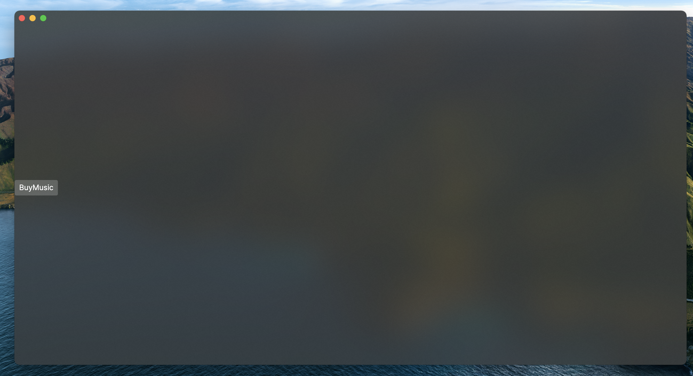
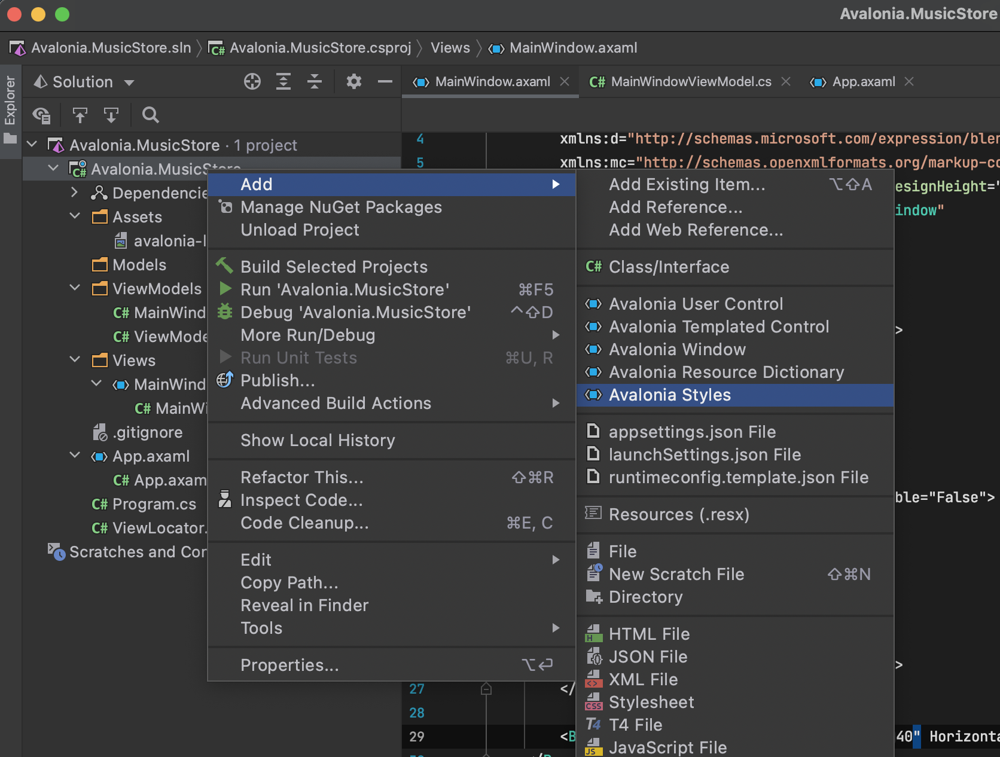
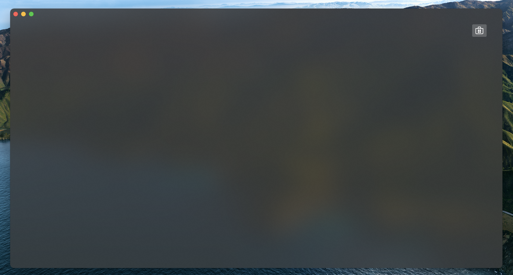

# Add and Layout Controls

## Add and Layout some Controls <a id="add-and-layout-some-controls"></a>

Let's start by adding a `Button` to the `MainWindow`. The button will allow the `user` to purchase music in order to add to their collection.

In `MainWindow.axaml` change the code as follows, adding a Button inside the Panel.

```markup
<Panel>
    <ExperimentalAcrylicBorder IsHitTestVisible="False">
        <ExperimentalAcrylicBorder.Material>
            <ExperimentalAcrylicMaterial
                 BackgroundSource="Digger"
                 TintColor="Black"
                 TintOpacity="1"
                 MaterialOpacity="0.65" />
        </ExperimentalAcrylicBorder.Material>
     </ExperimentalAcrylicBorder>

     <Button Content="Buy Music" Command="{Binding BuyMusicCommand}"/>
</Panel>
```

Notice that we have set the `Content` property of the `Button` to `Buy Music`, and we also set a property called `Command` to `{Binding BuyMusicCommand}`.

If you remember earlier in the section about MVVM we discussed how `Views` use `Bindings` to talk to the `ViewModel`.

This `Binding Expression` is saying, when the button is `clicked`, then `execute` the `command` called `BuyMusicCommand` on the ViewModel.

Open `MainWindowViewModel.cs` and add the following code (the `ICommand` Interface requires `System.Windows.Input` but you'll need the additional namespaces, specified at the top, later on in the tutorial):

```csharp
using System;
using System.Collections.ObjectModel;
using System.Linq;
using System.Reactive.Concurrency;
using System.Reactive.Linq;
using System.Windows.Input;
using ReactiveUI;

namespace Avalonia.MusicStore.ViewModels

public class MainWindowViewModel : ViewModelBase
    {
        public MainWindowViewModel()
        {
            BuyMusicCommand = ReactiveCommand.Create(() =>
            {
                // Code here will be executed when the button is clicked.
            });
        }

        public ICommand BuyMusicCommand { get; }
    }
```

Pressing the `Debug Button` again to run the program we can see we have a button and when clicked setting a breakpoint inside the `BuyMusicCommand` code we can see that the code is executed when it's hit.



Let's position the button to the top right of the screen and make it look a bit nicer.

Place the `<Button>` element inside a simple `<Panel>` element.

The simplest way to control the layout of a control is with the `HorizontalAlignment`and `VerticalAlignment` properties.

```markup
<Panel Margin="40">
  <Button Content="Buy Music" Command="{Binding BuyMusicCommand}" HorizontalAlignment="Right" VerticalAlignment="Top" />
</Panel>
```

We also add a `Margin` of 40 to the `Panel` so that the button is not right at the edge of the Window.

You may prefer to have an icon or image instead of text inside your button. The are a few ways to do this, let's grab a store icon from [Avalonia - Fluent Icons](https://avaloniaui.github.io/icons.html)

Scroll through this page and find an icon you like, then simply copy the code provided.

Find the name, in this case `store_microsoft_regular`.

There should be some code similar to:

```markup
<StreamGeometry x:Key="store_microsoft_regular">M11.5 9.5V13H8V9.5H11.5Z M11.5 17.5V14H8V17.5H11.5Z M16 9.5V13H12.5V9.5H16Z M16 17.5V14H12.5V17.5H16Z M8 6V3.75C8 2.7835 8.7835 2 9.75 2H14.25C15.2165 2 16 2.7835 16 3.75V6H21.25C21.6642 6 22 6.33579 22 6.75V18.25C22 19.7688 20.7688 21 19.25 21H4.75C3.23122 21 2 19.7688 2 18.25V6.75C2 6.33579 2.33579 6 2.75 6H8ZM9.5 3.75V6H14.5V3.75C14.5 3.61193 14.3881 3.5 14.25 3.5H9.75C9.61193 3.5 9.5 3.61193 9.5 3.75ZM3.5 18.25C3.5 18.9404 4.05964 19.5 4.75 19.5H19.25C19.9404 19.5 20.5 18.9404 20.5 18.25V7.5H3.5V18.25Z</StreamGeometry>
```

Let's create a file just for Icons.

In Rider right click on the project and select `Add` → `Avalonia Styles`



Enter the name `Icons` when prompted and press `Enter`.

A new `xaml` file will be created that we can put styles or icons inside.

```markup
<Styles xmlns="https://github.com/avaloniaui"
        xmlns:x="http://schemas.microsoft.com/winfx/2006/xaml">
    <Design.PreviewWith>
        <Border Padding="20">
            <!-- Add Controls for Previewer Here -->
        </Border>
    </Design.PreviewWith>

    <!-- Add Styles Here -->
</Styles>
```

Add your Icon code inside wrapped in a `Style` element as a resource like so.

```markup
<Styles xmlns="https://github.com/avaloniaui"
        xmlns:x="http://schemas.microsoft.com/winfx/2006/xaml">
    <Design.PreviewWith>
        <Border Padding="20">
            <!-- Add Controls for Previewer Here -->
        </Border>
    </Design.PreviewWith>

    <!-- Add Styles Here -->
    <Style>
        <Style.Resources>
            <StreamGeometry x:Key="store_microsoft_regular">M11.5 9.5V13H8V9.5H11.5Z M11.5 17.5V14H8V17.5H11.5Z M16 9.5V13H12.5V9.5H16Z M16 17.5V14H12.5V17.5H16Z M8 6V3.75C8 2.7835 8.7835 2 9.75 2H14.25C15.2165 2 16 2.7835 16 3.75V6H21.25C21.6642 6 22 6.33579 22 6.75V18.25C22 19.7688 20.7688 21 19.25 21H4.75C3.23122 21 2 19.7688 2 18.25V6.75C2 6.33579 2.33579 6 2.75 6H8ZM9.5 3.75V6H14.5V3.75C14.5 3.61193 14.3881 3.5 14.25 3.5H9.75C9.61193 3.5 9.5 3.61193 9.5 3.75ZM3.5 18.25C3.5 18.9404 4.05964 19.5 4.75 19.5H19.25C19.9404 19.5 20.5 18.9404 20.5 18.25V7.5H3.5V18.25Z</StreamGeometry>
        </Style.Resources>
    </Style>
</Styles>
```

Open `App.axaml` and add a `StyleInclude` so that the `Icons.axaml`can be loaded.

```markup
<Application.Styles>
    <FluentTheme Mode="Dark"/>
    <StyleInclude Source="avares://Avalonia.MusicStore/Icons.axaml" />
</Application.Styles>
```

Now build the application so that the Icons are available in the previewer.

Return to `MainWindow.axaml`, we can add the Icon to the Button like so...

```markup
<Button Margin="40" HorizontalAlignment="Right" VerticalAlignment="Top" Command="{Binding BuyMusicCommand}">
    <PathIcon Data="{StaticResource store_microsoft_regular}" />
</Button>
```

Running the application we now have a nice button.



