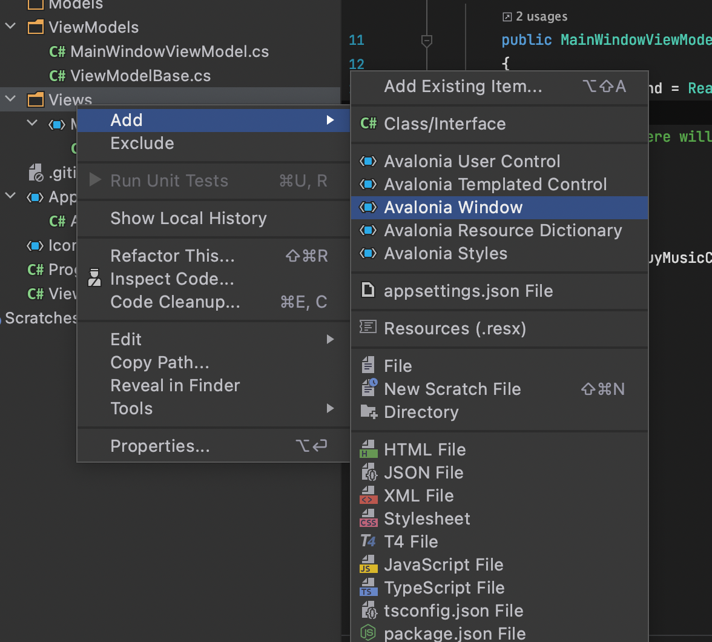
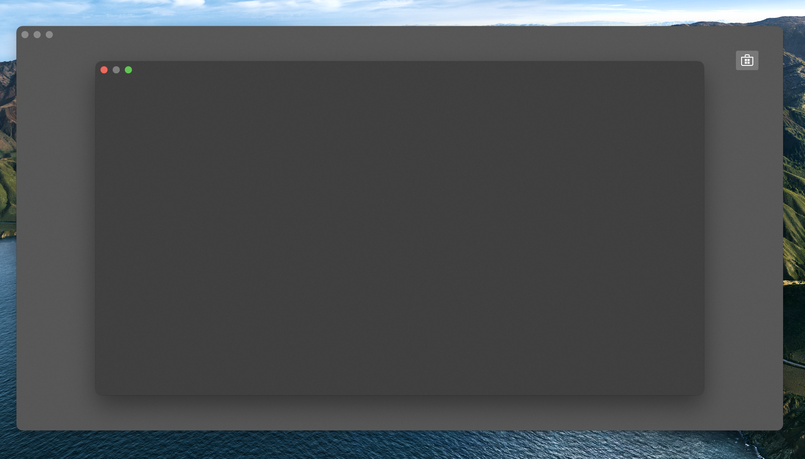

# Opening a Dialog

## Opening a Dialog <a id="opening-a-dialog"></a>

Opening a dialog is an advanced topic, if you are very new to Avalonia, try not to get too stuck on this section, you may want to just copy in the code and move on. Then come back once you have a better understanding of some of the basics.

In this section we shall make it so that clicking the Store Button opens a `modal dialog` where the user can search for albums to buy.

First we need to add a Window to the project, right click on the `Views` folder and select `Add` → `Avalonia Window`.

When prompted name this MusicStoreWindow and press the `Enter` key.



This will add the following code:

```markup
<Window xmlns="https://github.com/avaloniaui"
        xmlns:x="http://schemas.microsoft.com/winfx/2006/xaml"
        xmlns:d="http://schemas.microsoft.com/expression/blend/2008"
        xmlns:mc="http://schemas.openxmlformats.org/markup-compatibility/2006"
        mc:Ignorable="d" d:DesignWidth="800" d:DesignHeight="450"
        x:Class="Avalonia.MusicStore.Views.MusicStoreWindow"
        Title="MusicStoreWindow">
    Welcome to Avalonia!
</Window>
```

Change this code as follows to enable the Acrylic and extended client area so the Window will look like our `MainWindow`.

```markup
<Window xmlns="https://github.com/avaloniaui"
        xmlns:x="http://schemas.microsoft.com/winfx/2006/xaml"
        xmlns:d="http://schemas.microsoft.com/expression/blend/2008"
        xmlns:mc="http://schemas.openxmlformats.org/markup-compatibility/2006"
        mc:Ignorable="d" d:DesignWidth="800" d:DesignHeight="450"
        x:Class="Avalonia.MusicStore.Views.MusicStoreWindow"
        Title="MusicStoreWindow"
        TransparencyLevelHint="AcrylicBlur"
        ExtendClientAreaToDecorationsHint="True">
    <Panel>
        <ExperimentalAcrylicBorder IsHitTestVisible="False">
            <ExperimentalAcrylicBorder.Material>
                <ExperimentalAcrylicMaterial
                    BackgroundSource="Digger"
                    TintColor="Black"
                    TintOpacity="1"
                    MaterialOpacity="0.65" />
            </ExperimentalAcrylicBorder.Material>
        </ExperimentalAcrylicBorder>

        <Panel Margin="40">

        </Panel>
    </Panel>
</Window>
```

Now lets see how we can open this Window.

Avalonia comes with the [ReactiveUI - An advanced, composable, reactive model-view-viewmodel framework](https://www.reactiveui.net/). Other MVVM frameworks are available and you can work without one if you wish.

ReactiveUI makes it very easy to get started and provides a lot of functionality out of the box.

In order that we can open the dialog from the ViewModel, we will use what is called an `interaction` \([ReactiveUI - Interactions](https://www.reactiveui.net/docs/handbook/interactions/)\)

Firstly right click on your ViewModel folder and `Add` → `Class / Interface` the following class names:

`MusicStoreViewModel`, `AlbumViewModel`

we will leave the code as it is for now.

Now open `MainWindowViewModel.cs` and add the following code:

```csharp
public Interaction<MusicStoreViewModel, AlbumViewModel?> ShowDialog { get; }
```

The constructor will also change so that it instantiates the `ShowDialog` interaction. Notice that the `System.Reactive.Linq` namespace is added to the top and the BuyMusicCommand is changed to use `CreateFromTask`.

```csharp
using System;
using System.Collections.Generic;
using System.Reactive.Linq;
using System.Text;
using System.Windows.Input;
using ReactiveUI;

namespace Avalonia.MusicStore.ViewModels
{
    public class MainWindowViewModel : ViewModelBase
    {
        public MainWindowViewModel()
        {
            ShowDialog = new Interaction<MusicStoreViewModel, AlbumViewModel?>();

            BuyMusicCommand = ReactiveCommand.CreateFromTask(async () =>
            {
                var store = new MusicStoreViewModel();

                var result = await ShowDialog.Handle(store);
            });
        }

        public ICommand BuyMusicCommand { get; }

        public Interaction<MusicStoreViewModel, AlbumViewModel?> ShowDialog { get; }
    }
}
```

This still wont do much because some plumbing code is required in the so called "code behind".

Open `MainWindow.xaml.cs` you may need to expand the `MainWindow.axaml` file in to see this file.

* Make the `MainWindow` class inherit `ReactiveWindow<MainWindowViewModel>` instead of just `Window`.

  This allows ReactiveUI to help us out a little bit. It also shows that this View knows about its ViewModel, this is allowed. Check the MVVM section above.

* Add a `DoShowDialogAsync` method like so:

```csharp
private async Task DoShowDialogAsync(InteractionContext<MusicStoreViewModel, AlbumViewModel?> interaction)
{
     var dialog = new MusicStoreWindow();
     dialog.DataContext = interaction.Input;

     var result = await dialog.ShowDialog<AlbumViewModel?>(this);
     interaction.SetOutput(result);
}
```

This method creates the MusicStoreWindow, it sets its `DataContext` to interaction.Input, which is the instance of the `ViewModel`.

It then calls `await dialog.ShowDialog<AlbumViewModel?>(this)` on the dialog, passing `this` as an argument, showing that the `MainWindow` currently represented by `this` pointer will be the `owner` or `parent` window.

The code will stay awaiting asynchronously until the viewmodel closes the dialog and sets a result on the interaction.

Once the dialog has closed, it will return the result, which will be of type `AlbumViewModel` or `null` if the dialog is cancelled.

`interaction.SetOutput (result)` is then called. This causes the interaction to end, and the program will return to our `MainWindowViewModel` where we left of at the call to `var result = await ShowDialog.Handle(store);`.

* Add the following `WhenActivated` call to the Windows constructor.

```csharp
this.WhenActivated(d => d(ViewModel!.ShowDialog.RegisterHandler(DoShowDialogAsync)));
```

`d` is an `Action` that takes a `disposable`, this means that ReactiveUI will clean up any subscriptions when this View is not on the screen for us.

Our entire `MainWindow.xaml.cs` should now look like:

```csharp
using System.Threading.Tasks;
using Avalonia;
using Avalonia.Controls;
using Avalonia.Markup.Xaml;
using Avalonia.MusicStore.ViewModels;
using Avalonia.ReactiveUI;
using ReactiveUI;

namespace Avalonia.MusicStore.Views
{
    public partial class MainWindow : ReactiveWindow<MainWindowViewModel>
    {
        public MainWindow()
        {
            InitializeComponent();
            this.WhenActivated(d => d(ViewModel!.ShowDialog.RegisterHandler(DoShowDialogAsync)));
        }

        private async Task DoShowDialogAsync(InteractionContext<MusicStoreViewModel, AlbumViewModel?> interaction)
        {
            var dialog = new MusicStoreWindow();
            dialog.DataContext = interaction.Input;

            var result = await dialog.ShowDialog<AlbumViewModel?>(this);
            interaction.SetOutput(result);
        }
    }
}
```

Now open `MainWindow.axaml` and set the property `WindowStartupLocation="CenterScreen"`on the `<Window>` element.

Open `MusicStoreWindow.axaml` and set `WindowStartupLocation="CenterOwner"` on the `<Window>` element.

These properties mean that the `MainWindow` will be positioned in the center of the users monitor when the program loads, and that the dialog window will be positioned in the center of the `MainWindow` that owns it.

Also set `Width` and `Height` properties of the `MusicStoreWindows` `<Window>` element to 1000 and 550 respectively.

Now run the application and click the Store button.



As you can see the dialog window is opened perfectly centered inside the MainWindow.

